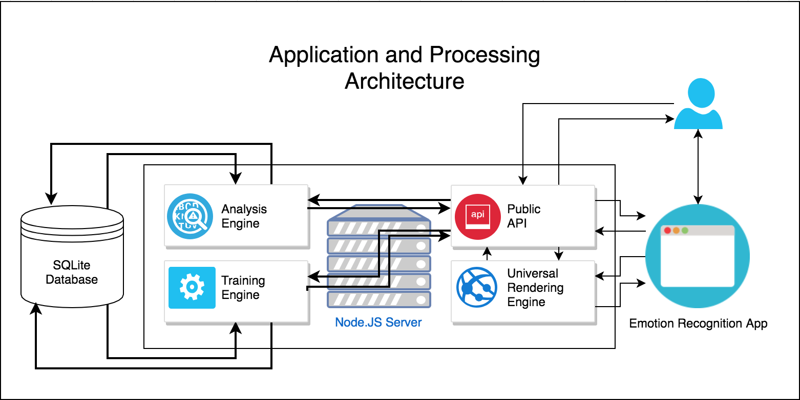

A universal JavaScript applications for expression recognition, utilizing:

* Node.JS
* Express
* Razzle
* Face Recognition
* OpenCV
* LibSVM
* TensorFlow

##Application Architecture


**This Application Includes**:

* Universal Hot Module Replacement, keeping client and server up-to-date 
* ES6 JavaScript support
* CSS support
* [React](https://github.com/facebook/react) for component based interface development
* [Jest](https://github.com/facebook/jest) test runner setup

## Quick Start
```bash
npm install # That's it
```

### `npm start` or `yarn start`

Runs the project in development mode.  
You can view your application at `http://localhost:3000`

The page will reload if you make edits.

### `npm run build` or `yarn build`

Builds the app for production, with minification and hashed assets.

### `npm run start:prod` or `yarn start:prod`

Runs the compiled app in production.

You can again view your application at `http://localhost:3000`

### `npm test` or `yarn test`

Runs the test watcher (Jest) in an interactive mode.
By default, runs tests related to files changed since the last commit.

### `rs`

Type `rs` in the terminal and press enter to manually restart the server.